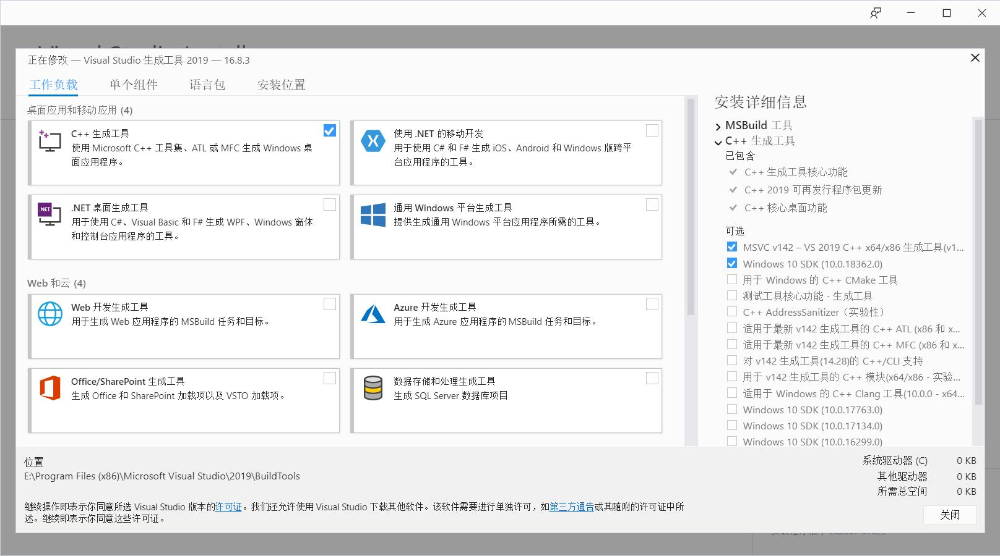
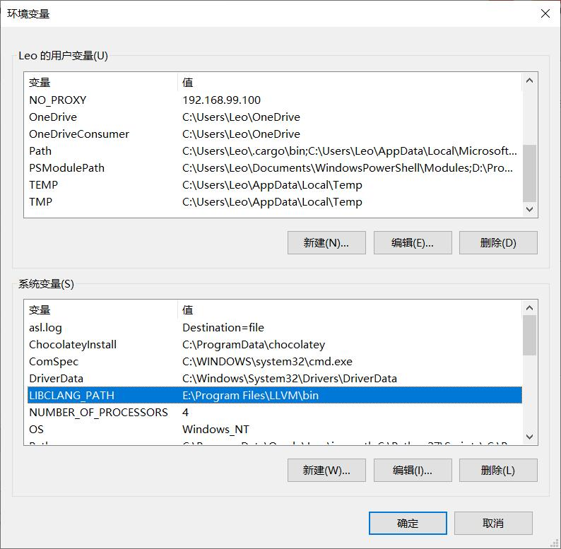

# 获取Acala测试网代币
1. 通过波卡钱包创建一个账号和地址

1. 打开聊天机器人链接
  
   https://riot.im/app/#/room/#acala-faucet:matrix.org
  
   在聊天输入框中输入命令
  
   `!drip <Address>`

   注：如果没有账号，需要注册一个账号。
   
   https://riot.im/app/#/register

1. 打开acala网站，查看获得的币。

   https://apps.acala.network/#/wallet
   
   

# 搭建Acala专用网络
1. Using Polkadot{JS} Extension
  
   https://github.com/AcalaNetwork/Acala/wiki/1.-Get-Started#using-polkadotjs-extension
   
1. Install Rust
  
   ```
   # Install
   curl https://sh.rustup.rs -sSf | sh
   # Configure
   source ~/.cargo/env
   rustup default nightly-2020-10-06
   rustup target add wasm32-unknown-unknown
   ```


##### How to install Rust on Windows
- install rust with RUST-INIT.exe
https://www.rust-lang.org/zh-CN/tools/install

- install C++ build tools
https://visualstudio.microsoft.com/zh-hans/visual-cpp-build-tools/


- install LLVM 10.0.0
http://releases.llvm.org/download.html

- set up LIBCLANG_PATH environment variable



   
1. Clone and Build
  
   ```
   git clone https://github.com/AcalaNetwork/Acala.git
   cd Acala
   git checkout -b 0.6.2 0.6.2
   make init
   make build
   ```
   
1. Start a Private Network

   1. Alice Starts First

      ```
      cd target/debug
      ./acala --base-path /tmp/alice --chain local --alice --port 30333 --ws-port 9944 --rpc-port 9933  --validator --rpc-methods=Unsafe --ws-external --rpc-external --ws-max-connections 1000 --rpc-cors=all --unsafe-ws-external --unsafe-rpc-external
      ```

   2. Bob Joins

      ```
      ./acala --base-path /tmp/bob --chain local --bob --port 30334 --ws-port 9945 --rpc-port 9934  --validator --bootnodes /ip4/127.0.0.1/tcp/30333/p2p/12D3KooWNHQzppSeTxsjNjiX6NFW1VCXSJyMBHS48QBmmGs4B3B9
      ```

1. 查看本地网络状态

   1. 打开控制台

      https://console.acala.network/

   2. 授权Polkadot{JS}插件

   3. 点击网站左上角，切换连接的网络为本地节点

      修改自定义终端为ws://127.0.0.1:9944

   4. 切换到网络 > 浏览页面，即可查看到网络区块的生成情况。


# 参考资料

初识Polkadot: https://xie.infoq.cn/article/e819ac0c6f60b8b2633484dec
开发三层介绍：https://medium.com/acalanetwork/acala-unveils-smart-contracts-and-ethereum-compatibility-for-polkadot-defi-588b3891e53d
开发者上手指南: https://substrate.dev/tutorials

Polkadot混合共识：https://xie.infoq.cn/article/149e09f0f8e00ac23edb8ebd4
Polkadot Wiki: https://wiki.polkadot.network/docs/zh-CN/learn-launch
官网博客翻译：https://polkadot.network/zh-cn/blog/
